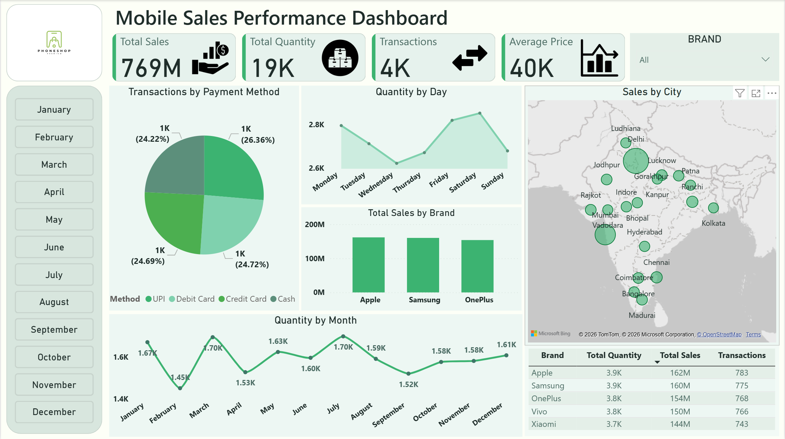

# 📱 Mobile Sales Performance Dashboard

<p align="center">
  
</p>

<p align="center">
  
  
  
  
</p>

---

## 📌 Project Overview

The **Mobile Sales Performance Dashboard** is a fully interactive, single-page Power BI report to give business stakeholders a 360° view of mobile phone sales operations across India. It consolidates transactional data spanning multiple cities, brands, payment channels, and time periods into a visually compelling and easy-to-navigate interface.

---

## 🎯 Key Features

- **📊 Executive KPI Cards** — Instantly surface the four most critical metrics: Total Sales, Total Quantity Sold, Number of Transactions, and Average Selling Price.
- **🗺️ Geographic Sales Map** — A bubble map visualizing sales volume across major Indian cities, making regional performance immediately apparent.
- **🏷️ Brand Performance Comparison** — A bar chart comparing total sales revenue across top brands (Apple, Samsung, OnePlus, Vivo, Xiaomi).
- **📅 Monthly Quantity Trend** — A line chart tracking unit sales across all 12 months to identify seasonal patterns and demand fluctuations.
- **📆 Day-of-Week Analysis** — A trend view showing quantity sold by day, helping identify the highest and lowest performing days of the week.
- **💳 Payment Method Breakdown** — A pie chart segmenting transactions into UPI, Debit Card, Credit Card, and Cash to understand customer payment preferences.
- **🔍 Interactive Filters** — A month slicer and brand dropdown allow users to drill into any specific time period or brand without leaving the page.
- **📋 Brand Summary Table** — A clean tabular view listing each brand's total quantity, total sales, and transaction count side by side.

---

## 📂 Dataset Description

> ⚠️ *The dataset used in this project is a simulated/sample mobile sales dataset for demonstration purposes.*

| Column Name | Data Type | Description |
|---|---|---|
| `Transaction ID` | Integer | Unique identifier for each sales transaction |
| `Day` | Integer | Numeric day of the month (e.g., 9, 10, 11) |
| `Month` | Integer | Numeric month of the transaction (e.g., 10 for October) |
| `Year` | Integer | Year of the transaction (e.g., 2021) |
| `Day Name` | Text | Name of the weekday (Monday, Saturday, Sun, etc.) |
| `Brand` | Text | Mobile phone brand — Xiaomi, Vivo, Samsung, Apple, OnePlus |
| `Units Sold` | Integer | Number of units sold in the transaction |
| `Price Per Unit` | Decimal (₹) | Selling price per unit in Indian Rupees |
| `Customer Name` | Text | Full name of the purchasing customer |
| `Customer Age` | Integer | Age of the customer at time of purchase |
| `City` | Text | Indian city where the sale occurred |
| `Payment Method` | Text | Mode of payment — UPI, Credit Card, Debit Card, Cash |
| `Customer Ratings` | Integer (1–5) | Customer satisfaction rating given post-purchase |
| `Mobile Model` | Text | Specific phone model sold (e.g., iPhone 12, Galaxy A51) |


**Dataset Size:** ~4,000 transactions | **Time Period:** Full calendar year (Jan–Dec) | **Region:** Pan-India

---

## 🛠️ Tools & Technologies

| Tool            | Purpose                                      |
|-----------------|----------------------------------------------|
| **Power BI Desktop** | Data modelling, DAX measures, report building |
| **Power Query**      | Data cleaning and transformation             |
| **DAX**              | Custom KPI calculations and measures         |
| **Bing Maps**        | Geographic bubble map visualization          |
| **Microsoft Excel / CSV** | Source data format                      |

---

## 📊 Dashboard Highlights & KPIs

| Metric              | Value     |
|---------------------|-----------|
| 💰 Total Sales       | ₹769 Million |
| 📦 Total Quantity    | 19,000 Units  |
| 🔁 Transactions      | 4,000         |
| 💵 Average Price     | ₹40,000       |

---

## 💡 Key Business Insights

The dashboard enables stakeholders to derive the following insights:

1. **Balanced Brand Competition** — Apple (₹162M), Samsung (₹160M), and OnePlus (₹154M) are closely matched in revenue, indicating a competitive and healthy market distribution.

2. **Uniform Payment Adoption** — All four payment methods (UPI, Debit Card, Credit Card, Cash) hold nearly equal share (~25% each), suggesting customers have no strong single preference — an important finding for checkout UX and finance planning.

3. **Seasonal Demand Dips** — February shows the lowest monthly quantity (1.45K units), likely tied to post-holiday slowdowns. July peaks at 1.70K units, possibly driven by mid-year sales events.

4. **Weekend Sales Surge** — The "Quantity by Day" chart shows a visible uptick toward Friday and Saturday, indicating weekend shopping behavior is significant.

5. **Metro vs. Tier-2 Cities** — The map reveals that metro hubs (Mumbai, Delhi) dominate in bubble size, while Tier-2 cities like Lucknow, Patna, and Indore are growing contributors.

6. **Vivo & Xiaomi Trailing** — Despite healthy volumes, Vivo (₹150M) and Xiaomi (₹144M) trail Apple by ~11–12%, suggesting a potential pricing or distribution gap worth investigating.

---


## 🚀 How to Use

### Prerequisites
- [Power BI Desktop](https://powerbi.microsoft.com/en-us/downloads/) (free) — Version: March 2024 or later recommended

### Steps

1. **Clone or Download this Repository**
   ```bash
   git clone https://github.com/abhikroy-kol/mobile-sales-dashboard.git
   cd mobile-sales-dashboard
   ```

2. **Open the Power BI File**
   - Launch **Power BI Desktop**
   - Go to `File → Open Report`
   - Select `Mobile_Sales_Dashboard.pbix`

3. **Connect or Refresh Data** *(if prompted)*
   - Go to `Home → Transform Data → Data Source Settings`
   - Update the file path to your local dataset if needed
   - Click `Refresh` to load the latest data

4. **Explore the Dashboard**
   - Use the **month buttons** on the left panel to filter by a specific month
   - Use the **Brand dropdown** (top right) to isolate a single brand
   - Hover over map bubbles, chart bars, or pie slices for **interactive tooltips**
   - Click any visual element to **cross-filter** the entire page

5. **Publish to Power BI Service** *(optional)*
   - Sign in to your Power BI account
   - Click `Home → Publish → Select Workspace`
   - Share the dashboard URL with your team

---

## 🔮 Future Improvements

| # | Enhancement | Priority |
|---|-------------|----------|
| 1 | **Add YoY / MoM Growth Metrics** — Include period-over-period comparison cards for sales and transactions | 🔴 High |
| 2 | **Drill-Through Pages** — City-level and brand-level detail pages accessible by right-clicking visuals | 🔴 High |
| 3 | **Profitability Analysis** — Incorporate cost data to visualize gross margin by brand and city | 🟡 Medium |
| 4 | **Customer Segmentation** — Add demographic filters (age group, gender) if data is available | 🟡 Medium |
| 5 | **Mobile Phone Model Breakdown** — Expand brand charts to show individual model-level performance | 🟡 Medium |
| 6 | **Dynamic Targets / Benchmarks** — Add a target line to quantity and sales trend charts | 🟢 Low |
| 7 | **Power BI Service Alerts** — Configure automated data refresh and email alerts for KPI thresholds | 🟢 Low |
| 8 | **Export to PDF Button** — Add a bookmark-based export action for non-Power BI users | 🟢 Low |

---

## 📁 Repository Structure

```
mobile-sales-dashboard/
│
├── 📊 Mobile-Sales-Performance-Dashboard.pbix    # Main Power BI report file
├── 📄 Mobile Sales Data.xlsx          # Source dataset (Excel)
├── 🖼️ mobile-sales-dashboard.png      # Dashboard screenshot
└── 📘 README.md                      # Project documentation (this file)
```

---

## 🙋 About the Author

**Abhik Roy**
📧 abhik.roy.kol@gmail.com
🔗 [LinkedIn](www.linkedin.com/in/abhik-roy-kol) | [GitHub](https://github.com/abhikroy-kol)

*Data Analyst passionate about transforming raw business data into clear, actionable visual stories using Power BI, SQL, and Python.*

---

---

<p align="center">
  ⭐ <strong>If you found this project useful, please consider giving it a star!</strong> ⭐
</p>
